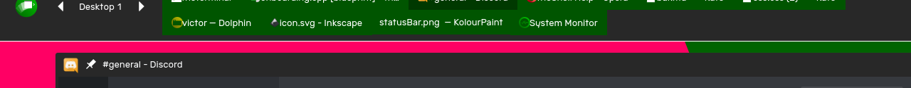

The Bar encompasses a simple view of your PC at any given moment.

# Status

The status of your PC is shown at the top of the bar. Visible items include
- Time and Date
- Timer (if one is set)
- Stopwatch (if one is set)
- Battery status
- Controls for brightness and volume
- Networking information
- Notifications
- System Tray icons

Clicking on any one of these icons will take you to the [Status Center].

# Window Management

Below the status indicators, you can find the desktop pager and the list of open windows.

The Desktop Pager shows the current desktop and allows you to change the current desktop.

The list of open windows allows you to see all the open windows on your device.

## Attention Demanding Windows

If an app wishes to get your attention, it will turn red in the bar, and when the bar is not visible, a red line will be shown on the top of the screen.

# Behaviour

When a window gets in the way of the Bar, it moves away to give space to the window.

**If the [Status Bar] is enabled,** the bar will move away and eventually become the Status Bar. To reveal the Bar again, hover over the Status Bar. 
**Otherwise,** the bar will move away completely. To reveal the Bar again, move your mouse to the top of the screen.


