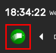
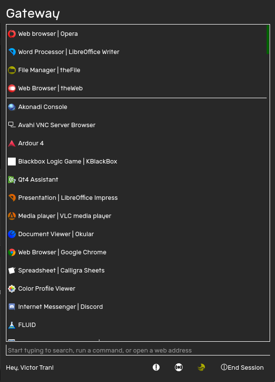

The Gateway is the portal to your PC. To open it, click on the theShell icon on the bar, or hit the SUPER key.   

# Elements

 
1. Apps
2. Box
3. Docked apps
4. Report Bug
5. Help
6. End Session

# Apps

All apps are listed in the Gateway. To open an app, open the Gateway and find the app that you want to open. Alternatively, use the Box to search for the app you wish to open.

# Box

The Box searches your PC, runs a command, does a task or opens a webpage depending on what you type. Try these:
- To open theMedia, type in "theMedia" and find theMedia in the list. Click on theMedia, or use the arrow keys and the ENTER key to navigate the app list.
- To run the command pavucontrol, simply type in "pavucontrol" into the box and hit ENTER. You can also pass arguments to the command by typing them in.

You don't even need to click on the box to use it. Simply hit the SUPER key or open the Gateway and enter your command.

# Docked apps

Docking apps keeps them at the top of the Gateway so they can be opened quickly.

## Docking an app

To dock an app,
1. Locate the app that you wish to dock by finding it in the Gateway or searching for it using the Box.
2. Right click on it.
3. Under "For (app name)" select the "Dock" option.

Now when you close and reopen the Gateway, the app will appear at the top, seperated by a white line.

## Undocking an app

Don't use a docked app any more? To undock an app,
1. Right click on the docked app, or find it in the Gateway or search for it in the Box
2. Right click on it
3. Under "For (app name)" select the "Undock" option.

When you close and reopen the Gateway, the app will no longer appear in the Docked Apps section of the Gateway.

# Bug Reporting

Click on the Bug Report button to open the bug reporting tool and report a bug with theShell.

# Help

Click on the Help button to open a web browser and go to theShell Help.

# End Session

To end your session and power off your device, select this option. For more information, go to [Ending your theShell Session]


[Ending your theShell Session]: q/endingsession
