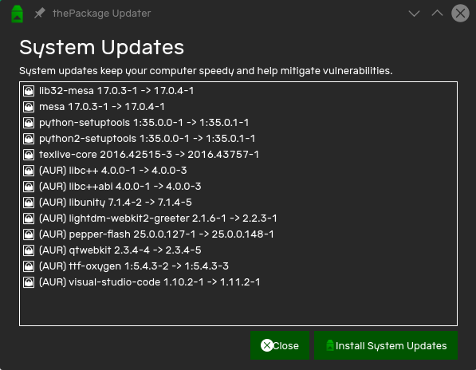

System Updates keep your system speedy and help mitigate vulnerabilities.

# Steps

To check for updates, start by opening thePackage Updater. Once it opens, it will check for updates from both the official repositories and the AUR. **Make sure you have a stable internet connection, otherwise this won't work.**
<p style="text-align: center;">

</p>
If you see the message "Thanks for stopping by. There aren't any updates available" then there are no updates available and you can close the updater.

Otherwise, click "Install System Updates" to install all the available system updates. This can take a while, but you will be able to continue using your device while the updates are being installed. Eventually, you will be asked for your password.

Once updates are complete, you can close the updater. If you see "You'll need to reboot to apply these updates" save all your work and press the Reboot button to reboot and install updates. Rebooting after an update doesn't take any longer than rebooting under normal conditions.

# Updating via the terminal

If some updates fail, use the terminal to perform system updates. Open a terminal and type the following command
```
yaourt -Syua
```

This command checks for updates from both the official repositories and the AUR, and installs them.
