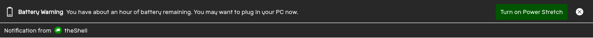

Power Stretch tries to save power so your device lasts longer. This is useful when your device is running out of power, and you aren't near a power source.

# Effects

Power Stretch does the following things to save your device's power:
- Turns off animations
- Disables some background checks
- Slows down timer based events

Other effects may be apparent in other applications that support Power Stretch.

# Activation

To activate power stretch,
1. Open the [Status Center]
2. Locate the Power Stretch Switch
3. Turn it on.

The Power Stretch Switch looks like  

## Low Battery

When your device runs low on battery, a notification like the following will appear to alert you.

Simply click on "Turn On Power Stretch" to switch on Power Strech.

When your device is connected to a power source, Power Stretch automatically turns off.

[Status Center]: statuscenter
