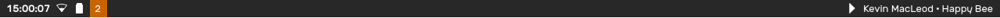

The Status Bar stays on the top of your screen and shows you information about your PC.

When hovering over the Status Bar, it extends to show the [Bar].

# Enabling the Status Bar

The Status Bar is not enabled by default. To enable it,
1. Open the Status Center and go to the System Settings pane
2. Navigate to the Bar section
3. Turn the "Use Status Bar" switch on.

The Staus Bar will now show up and persist on the top of the screen.

# Elements

From left to right, the Status Bar contains the following:
- Clock
- Connection Status
- Battery Status (if supported)
- Number of Notifications (if any)
- Currently playing media (if any)


