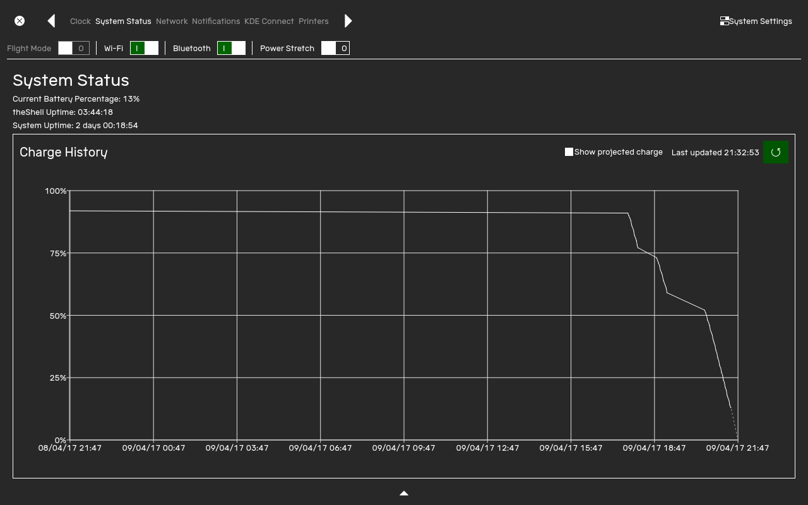

The Status Center allows you to see what your device is doing and allows you to configure it.

# Opening

To open the Status center, click on any of the top elements on the Bar.

# Panels

Different panels on the Status Center give you different information.

- [Clock](#clock)
- [System Status](#system-status)
- [Network](#network)
- [Notifications](#notifications)
- [KDE Connect](#kde-connect)
- [Printers](#printers)
- [System Settings](#system-setings)

## Clock

1. Current time and date
2. Calendar
3. Timer
4. Stopwatch

This pane gives you information on the current time, and allows you to perform time related things.

For more information on the timer and stopwatch, visit the [Timer] and the [Stopwatch] page.

To set the time and date, visit the [Settings] pane.

## System Status

This pane gives you information about general system status and battery information.

The battery graph shows you the charge of your battery for the past 24 hours.

## Network

This pane allows you to connect to the internet.

## Notifications

This pane shows you any notifications you may have missed.

## KDE Connect

This pane allows you to control KDE Connect devices. For more information about KDE Connect, visit the [KDE Connect website].

## Printers

This pane allows you to view the status of printers connected to this PC.

## System Settings
For information about this pane, visit [Settings]

[Timer]: timer
[Stopwatch]: stopwatch
[Settings]: settings
[KDE Connect website]: https://community.kde.org/KDEConnect
